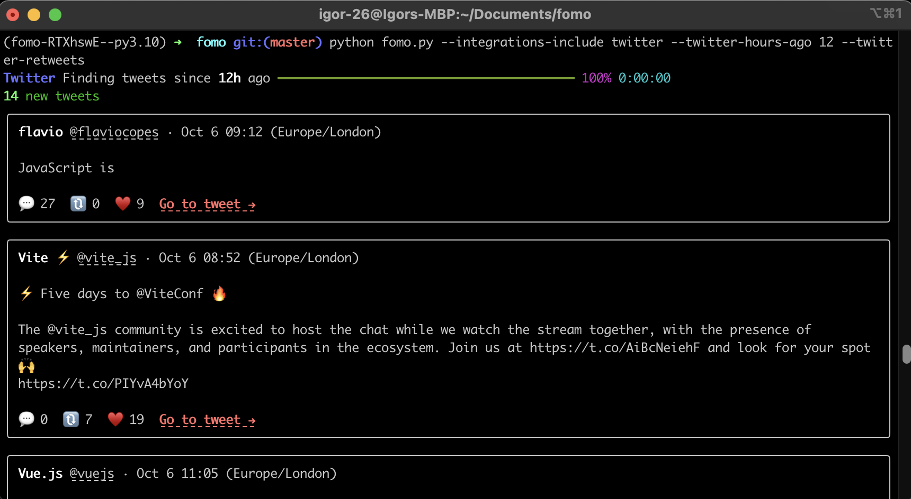
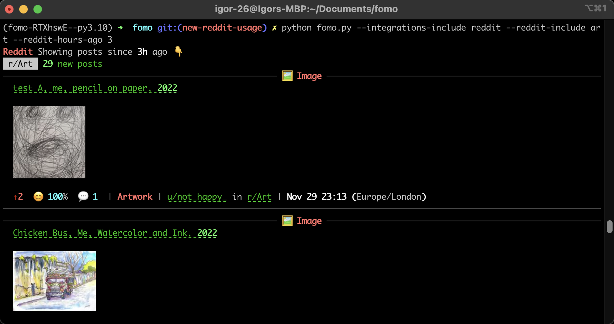
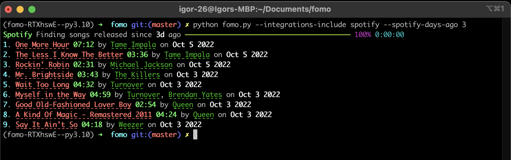

<p align="center">
  
</p>

**FOMO** is a CLI tool that helps you stay up to date with your social media.
<br>No ads, no suggested content, only the content you are subscribed to.

## Showcase


## Getting Started

1. Clone the repository

```bash
git clone git@github.com:igor-26/fomo-cli.git
 ```

2. Navigate to project root

```bash
cd fomo-cli
 ```

3. Spawn poetry shell

```bash
poetry shell
 ```

4. Install dependencies

```bash
poetry install
 ```
5. Create `.env` from the provided `.env.example`

```bash
cat .env.example >> .env
 ```

6. Configure integrations following the instructions provided in `.env`

## Usage

**General options**

**`--integrations-include`** | `reddit spotify twitter`

List of integrations to include.

**`--integrations-exclude`** | `reddit spotify twitter`

List of integrations to exclude.

**Note:** If omitted, all integrations specified in the `.env` will be run.

---

### Twitter


**`--twitter-hours-ago`** | `int`

Hours since tweet creation.

**Note:** If omitted, this will default to `TWITTER_HOURS_AGO` specified in the `.env`

---

**`--twitter-include`** | `<twitter_user_1> <twitter_user_2> ...`

List of users to include.

**`--twitter-exclude`**  | `<twitter_user_1> <twitter_user_2> ...`

List of users to exclude.

**Note:** If omitted, all twitter users the user is subscribed to will be checked.

---
**`--twitter-replies`**

Include replies.

---
**`--twitter-retweets`**

Include retweets.

---

**Example**

List tweets and retweets created in the last 12 hours.
```python
python fomo.py --integrations-include twitter --twitter-hours-ago 12 --twitter-retweets
 ```
<p align="center">
  
</p>

### Reddit


**`--reddit-hours-ago`** | `int`

Hours since post creation.

**Note:** If omitted, this will default to `REDDIT_HOURS_AGO` specified in the `.env`.

---

**` --reddit-include`** | `<subreddit_1> <subreddit_2> ...`

List of subreddits to include.

**` --reddit-exclude`** | `<subreddit_1> <subreddit_2> ...`

List of subreddits to exclude.

**Note:** If omitted, all subreddits the user is subscribed to will be checked.

---

**Example**

List posts from `r/food` created in the last 3 hours.
```python
python fomo.py --integrations-include reddit --reddit-include food --reddit-hours-ago 3
 ```
<p align="center">
  
</p>

### Spotify

**`--spotify-days-ago`** | `int`

Days since a song was released.

**Note:** If omitted, this will default to `SPOTIFY_DAYS_AGO` specified in the `.env`.

---
**Example**

List songs released in the last 3 days from artists the user is subscribed to.
```python
python fomo.py --integrations-include spotify --spotify-days-ago 3
 ```
<p align="center">
  
</p>
